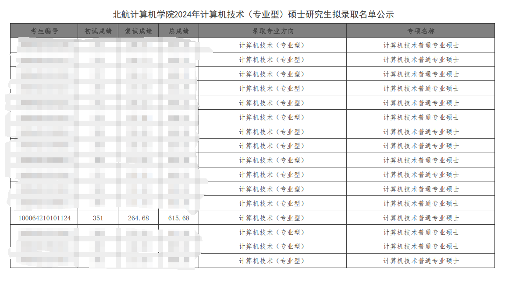

# 考研

综合成绩

说实话，初试成绩出来我都没有什么希望能上，特别是已经拿到港前三offer的情况下。但复试比较幸运，机试成绩不错，面试发挥也比较稳定，凭借复试第六成功上岸。

个人情况

平均GPA3.4左右，优势英语，数学专业课一般，多次参加算法竞赛，有一定的算法开发经验，没有含金量高的奖项论文。

时间安排

4-5月左右开始准备考研，在7月左右开始考虑港校申请，于8月底得到合适的雅思成绩后全力考研

港校

有条件的可以考虑把港校作为Plan B，特别是英语无压力，有过对口实习经验的情况下。此时准备港校的原因是此时正是知识结构最完整的时候，在面试时相对其他时间申请压力相对较小。但是当然要注意自己的时间管理与情绪管理，不然就会两边都抓不上

数学

我数学基础一般，首先刷了武忠祥660打基础，后期以刷卷为主，穿插强化课视频。现在比较后悔没有直接进行系统的强化专题训练，当时模考成绩也很不理想，每次都是通过刷卷积累的零星知识点，没有形成系统。线代与概率听kira醒脑才有些起色，高数每次考都会有一些小漏洞

考试的心态问题我是通过欧几里得实时考试进行锻炼的，对于不会的题目，需要清楚有哪些步骤能够得分；选择题的排除技巧与填空题的设值技巧也需要掌握。此次考研数学我基本上拿了所有能拿的分才能考这个分

专业课

北航考研还没有改408的消息，科目是自命题961，题目比较稳定。这里强烈建议通过机构或网盘拿到历年真题，基本上题型与历年真题不会有很大差别。961与408最大的不同是计组涉及到的mips和指令流水线，并且会考一些408不考的细节知识点。总体难度低于408

英语

八月份的雅思准备可能对我的阅读写作能力有点提升，因此除了墨墨背单词刷了单词，考前背作文就没有准备考研英语，这方面可以参考别人的攻略

政治

强烈建议稍微晚些再准备政治，大概在十一月左右。重视利用小程序刷选择题与十二月密集背诵肖四，政治不拖后腿还是比较简单的

复试

复试考机试与面试，若大学四年的编程专业课没有问题，机试通过较简单，但满分不太容易。冲高分需要在平时与复试前多刷算法题，对基础数据结构有所了解；面试考基础，若有比较好表达能力即使紧张也能取得一个还可以的成绩。若初试考完觉得比较稳就需要在寒假有针对性地进行复试准备，关注一下往年的机试与面试消息

结语

作为初试分比较低上岸的2024地大计科科班，我感到比较幸运，同时也很感谢自己的努力。若是我的方法对你来说不合理，也可以看看这位北大软微414分上岸大佬的经验分享：

